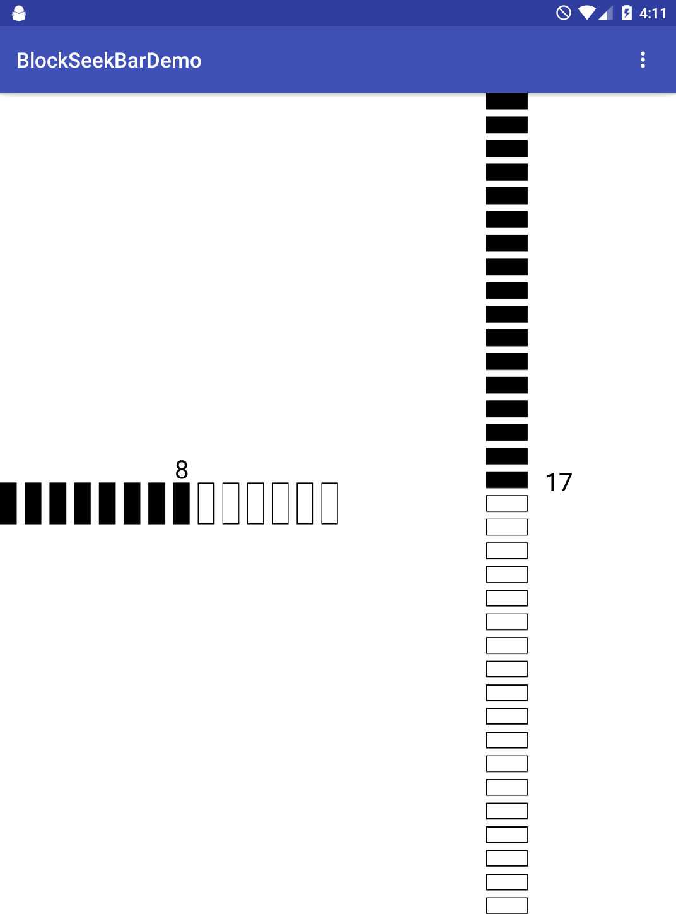
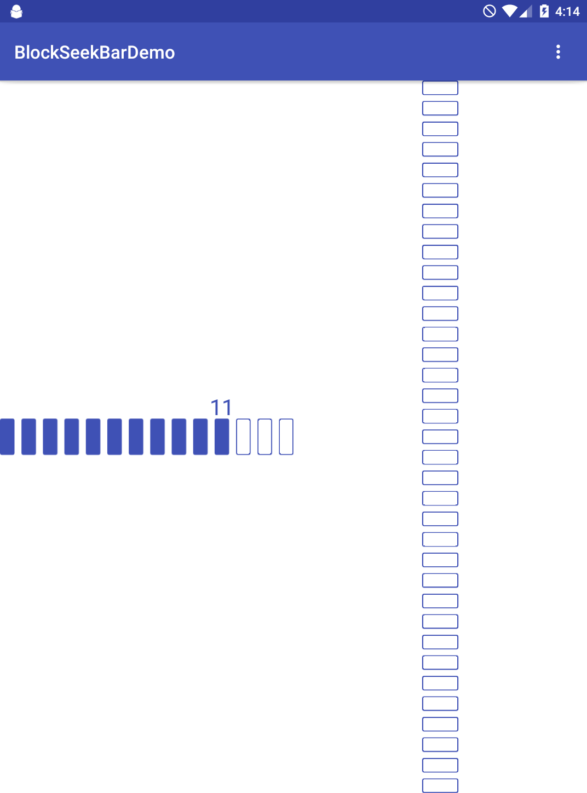

# BlockSeekBar
SeekBar tumb with Block

which supports Horizontal and Vertical.

# attrs
 - android:orientation
 - block_width 
 - block_height
 - block_line_width
 - block_space
 - block_radius
 - block_color
 - block_progress
 - block_max
 - block_text_size
 - block_text_space
 - block_drawtext   #boolean

